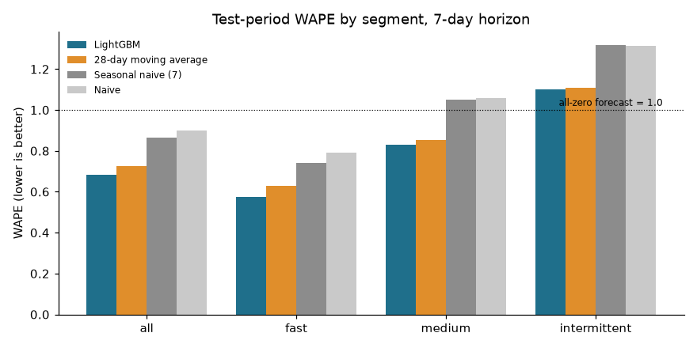
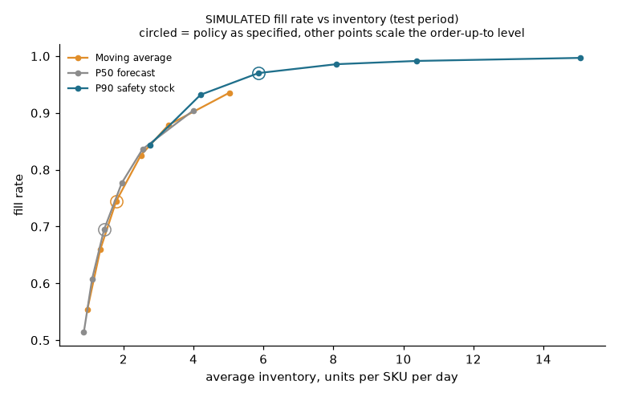

# SKU-level demand forecasting with a simulated reorder policy

This project forecasts daily unit sales seven days ahead for 100 SKUs in one store, compares LightGBM against simple baselines on a held-out final period, and then feeds the forecasts into a simulated reorder policy to see what better forecasts do to stock and fill rate.

The data is M5 (Walmart) retail sales, used as a stand-in for dark-store demand. It is not quick-commerce data, and the conclusions should be read with that in mind.

## Summary

On a held-out 91-day test period, LightGBM reaches a WAPE of 0.683 against 0.725 for a 28-day moving average, the strongest baseline, a gain of about 6%. The gain comes mostly from fast-selling SKUs; for intermittent SKUs the two are effectively tied. In a simulated reorder comparison, a P90-based policy fills 97.0% of demand against 74.5% for the moving-average policy, but it holds about three times the stock, and at equal inventory its advantage is between 0.1 and 2.3 points of fill rate.

## Data and slice rule

I used store CA_1 from M5, daily sales from 2011-01-29 to 2016-05-22. The 100 SKUs are picked by a rule that only looks at the year before the first validation fold: an item must have been selling before that year and sold at least once in it. Items with zero sales on at least half of the days are intermittent; the rest are split at the median daily volume into fast and medium. I drew 34 fast, 33 medium and 33 intermittent SKUs at random with a fixed seed.

M5 lists zeros for days before an item launched, and these are not demand, so each series starts at its first sale. After that, 45.3% of SKU-days have zero sales (22.7% fast, 45.2% medium, 68.6% intermittent), and a third of the series are intermittent by construction. No prices were missing after the trim. Details are in [docs/assumptions.md](docs/assumptions.md).

## Leakage controls

The forecast horizon is 7 days. Every row is one SKU, one origin day and one step of 1 to 7 days ahead, and every feature built from sales uses data up to and including the origin day. Same-weekday lags (the sales one to four weeks before the target day) stay at or before the origin because the step is at most 7.

Four features describe the target day and are used because they are known in advance: weekday and month, the SNAP payout flag, an event flag, and price. Price is the one I am least sure of, since M5 gives realised prices and I assume the price for the next week is set ahead. Each is justified in the assumptions file.

[tests/test_features.py](tests/test_features.py) scrambles all sales after a cutoff date and checks that features for every earlier origin are unchanged. I confirmed the test fails when I deliberately shift a lag by one day. There are separate tests that each target equals the sales on its target date and that every same-weekday lag falls on or before the origin.

Validation is a rolling-origin backtest with three 28-day folds and an expanding training window, followed by a final 91-day test period (2016-02-22 to 2016-05-22). There are no random splits. The test period was scored once, after the model settings were frozen. Tuning was a grid of 8 settings scored on the three validation folds only.

## Results

The primary metric is WAPE (total absolute error divided by total sales). MAPE is not used because 45% of SKU-days have zero sales, where it is undefined; see [docs/metric_definitions.md](docs/metric_definitions.md). Because WAPE of a forecast that is never zero can exceed 1.0 on sparse series, bias and MAE are reported too.

Test period, seven-day horizon, 100 SKUs (63,700 forecasts):

| Segment | LightGBM | 28-day moving average | Seasonal naive (7 days) | Naive |
|---|---|---|---|---|
| All | 0.683 | 0.725 | 0.865 | 0.901 |
| Fast | 0.576 | 0.628 | 0.741 | 0.793 |
| Medium | 0.831 | 0.853 | 1.051 | 1.056 |
| Intermittent | 1.100 | 1.110 | 1.319 | 1.315 |

Mean of the three validation folds, for comparison:

| Segment | LightGBM | 28-day moving average | Seasonal naive (7 days) | Naive |
|---|---|---|---|---|
| All | 0.685 | 0.713 | 0.887 | 0.909 |
| Fast | 0.577 | 0.611 | 0.776 | 0.803 |
| Medium | 0.855 | 0.877 | 1.066 | 1.081 |
| Intermittent | 1.200 | 1.183 | 1.404 | 1.393 |



The best simple baseline is the 28-day moving average, and the model beats it by about 6% (relative) overall on the test period, mostly in the fast segment. The gain is modest. On the 91 test days LightGBM has the lower WAPE for 70 of the 100 SKUs (28 of 34 fast, 23 of 33 medium, 19 of 33 intermittent), so it is not a uniform win.

In the intermittent segment the model does not clearly beat the moving average. It is marginally better on the test period (1.100 against 1.110) and worse on average over the validation folds (1.200 against 1.183), with a higher bias in validation (+6.4% against -2.0%). I would treat that segment as a tie. WAPE above 1.0 there means that predicting zero on every day would score better on WAPE, which is a property of the metric on sparse series and not evidence the forecasts are useless; MAE for the segment is 0.668 against 0.674.

Test-period bias is small overall (LightGBM -0.4%, moving average +1.4%) but not zero for every segment: LightGBM under-forecasts medium SKUs by 3.1% and the moving average over-forecasts fast SKUs by 3.9%.

The model relies mostly on recent demand level. The 14-, 28- and 7-day rolling means carry about 47%, 19% and 9% of the total split gain; price, weekday and month together carry under 10%. Charts are in `reports/`: [WAPE by segment](reports/wape_by_segment.png), [feature importance](reports/feature_importance.png) and [actual vs forecast for five SKUs](reports/actual_vs_forecast.png). The five SKUs are picked by rule (best fast, median of each segment, and the worst fast or medium SKU) and include a poor case, FOODS_3_057, whose sales stay at zero for long stretches that neither model anticipates.

The P50 and P90 quantile models were also fitted. P90 coverage on the test period is 90.3% overall (target 90%), and by segment 90.6% fast, 89.2% medium, 91.0% intermittent. P50 coverage is 57.9% overall and 66.1% for intermittent SKUs, since the median is zero on most days there.

## Reorder simulation (simulated)

This part is a simulation. No inventory, supplier or cost data exists; the assumptions are in [docs/assumptions.md](docs/assumptions.md). In short: daily review, a lead time of 2 days that I chose, a starting stock of three days of recent sales, order-up-to levels, and unmet demand is lost. All three policies get the same starting stock and run over the 91 test days.

| Policy (simulated) | Fill rate | Stockout-day share | Average inventory (units per SKU per day) |
|---|---|---|---|
| Moving average | 0.745 | 18.1% | 1.79 |
| P50 forecast | 0.694 | 22.4% | 1.44 |
| P90 safety stock | 0.970 | 1.9% | 5.86 |

The P90 policy fills far more demand but holds about three times the stock of the moving-average policy, so the raw comparison mostly shows the cost of more inventory. To separate stock level from forecast quality, I scaled each policy's order-up-to level and compared fill rates at the same average inventory ([chart](reports/simulation_tradeoff.png)). On that basis the differences are small. The P90 policy at 0.8 of its level holds 4.20 units and fills 93.2%, against 90.9% for the moving average at the same inventory, a gain of 2.3 points. At lower stock the gap is about 0.1 points. The P50 policy sits 0.2 to 1.5 points above the moving-average curve at equal inventory. The P90 policy as specified, at 5.86 units, is beyond the range the moving-average runs reach, so it cannot be compared directly at that point.



The P90 level adds daily P90 forecasts over the lead time, which overstates the P90 of the total, so that policy is conservative by construction. These results come from one 91-day window and one store.

## Limitations

This is a single store, and the SKUs were a stratified sample of 100 items from about 3,000, so segment results come from 33 or 34 series each. The data is grocery and household retail, not quick commerce: there is no hourly demand, no dark-store catalogue churn and no perishability. The test period is 91 days with no confidence intervals, so differences of about a point in WAPE should not be over-read.

Sales are censored: when an item was out of stock the recorded sales understate demand, and nothing here corrects for it. The model and the simulation both treat observed sales as demand, so the fill rates are optimistic about what true demand would be. The lead time, review period, starting stock and the lost-sales rule are assumed, not observed, and there are no real costs, so there is no profit or holding-cost analysis, only fill rate, stockout days and inventory. The policy comparison is simulated end to end.

The price feature assumes prices are known a week ahead. New SKUs are not handled: the features need 56 days of history, so a new item would get no forecast until then. Validation scores were used to choose the model settings, so they are slightly optimistic; the test results are the clean ones.

## Repository layout

`src/` holds the pipeline (`data_prep.py`, `features.py`, `baselines.py`, `train.py`, `evaluate.py`, `simulate_reorder.py`), `tests/` the leakage, metric and simulation tests, and `docs/` the assumptions and metric definitions. `notebooks/analysis.ipynb` has the narrative and charts, and `reports/` the result files and charts.

## Reproduce

Download the M5 files (`sales_train_evaluation.csv`, `calendar.csv`, `sell_prices.csv`) from Kaggle into `data/raw/`, which `make setup` creates. The code was run with Python 3.12; dependency versions are pinned in `requirements.txt`.

```bash
make setup
make prep
make test
make baselines
make train
make final
make simulate
make notebook
```

`make final` scores the held-out test period and should be run once, after `make train`. All seeds are fixed (42), and training uses LightGBM's deterministic mode.
